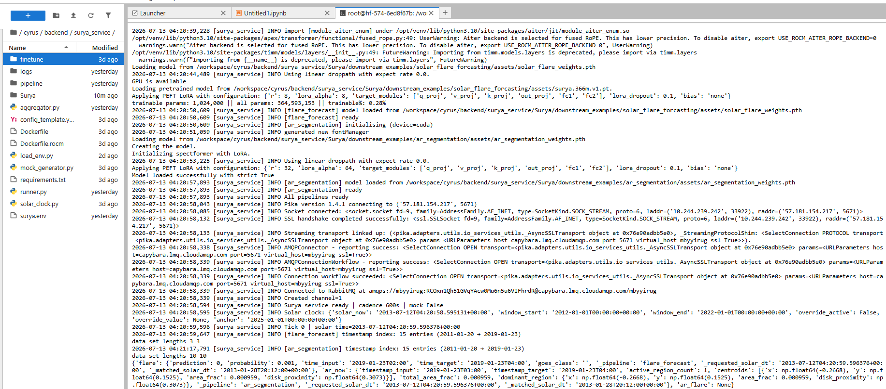

# Cyrus: Autonomous Space Weather Defense System

Cyrus turns NASA/IBM's **Surya** solar foundation model into a live, tick-based
threat-detection service, and pipes its predictions through a 5-agent
LangGraph response system that assesses risk and issues real (simulated)
protective actions across satellite, grid, and communications infrastructure —
visualized on a real-time 3D dashboard.
---

## What we built

**`surya_service`** — a Python inference service that loads NASA's Surya
366M-parameter foundation model plus LoRA-adapted heads for four downstream
tasks, runs inference on a fixed tick interval against real SDO/AIA + HMI
`.nc` solar observation data, aggregates the results with a rule-based threat
scoring model, and publishes each tick to RabbitMQ.

**`cyrus`** — a LangGraph-orchestrated multi-agent system
that consumes Surya's forecasts and, when a threat crosses a significance
threshold, runs:

1. **Helio Analyst** — interprets the raw forecast into a structured threat
   assessment (severity, risk scores, natural-language summary)
2. **SatOps**, **GridOps**, **CommsOps** (parallel) — each queries its own
   domain tool registry (satellite fleet, power grid topology, flight
   routes) and issues protective commands via tool calls
3. **Commander** — synthesizes all agent reports into a single executive
   brief

Every step is published live over Redis pub/sub → Server-Sent Events to a
**React + Three.js dashboard** (deployed on Vercel) showing a 3D sun with
EUV halo rings, a Kp-index storm dial, an animated solar wind particle
stream, live active-region markers, and a real-time agent activity log.

---

## AMD Resource Usage

This project runs Surya inference natively on **AMD** GPUs.



### GPU Inference Evidence

ROCm/GPU usage screenshots (model loading, live tick inference with connection to rabbitmq, rocm-smi
output) are available here: [docs/screenshots](https://github.com/CosmicAlison/cyrus/tree/main/docs/screenshots)

| Component | Detail |
|---|---|
| Hardware | AMD ROCm-managed GPUs |
| ROCm version | 7.2 |
| PyTorch | 2.9 (ROCm build) |
| What runs on GPU | Surya 366M backbone + PEFT/LoRA adapters for flare forecasting, EUV spectra forecasting, solar wind forecasting and AR segmentation, loaded and run per inference tick |

---

## External Services

| Service | Purpose | Where configured |
|---|---|---|
| **Fireworks AI** (`accounts/fireworks/models/minimax-m3`) | Powers all 5 LangGraph agents via LangChain's OpenAI-compatible client, pointed at Fireworks' inference endpoint | `backend/cyrus/agents/base_agent.py`, API key via `.env` |
| **RabbitMQ** (CloudAMQP, hosted) | Message queue between `surya_service` (producer, per-tick) and `helio_worker` (consumer) | `backend/surya_service/runner.py`, connection URL via `.env` |
| **Redis** | Pub/sub channel for dashboard live events (SSE bridge) and run-status tracking | `helio_worker`, `backend/cyrus/api/stream` endpoint |
| **Hugging Face Hub** | Source of Surya's pretrained weights and the SuryaBench downstream task datasets, pulled via each task's `download_data.sh` | `backend/surya_service/Surya/downstream_examples/*/download_data.sh` |
| **Vercel** | Frontend hosting | `frontend/cyrus` |

No other third-party APIs, model providers, or paid services are used.

---

## Architecture

```
┌─────────────────┐     tick (600s)     ┌──────────────────┐
│  surya_service   │ ──────────────────► │     RabbitMQ      │
│  (AMD)    │  raw forecast msg   │  cyrus.raw_forecast│
│                   │                     │  cyrus.telemetry   │
│  Surya 366M +     │                     └──────────┬─────────┘
│  LoRA heads:      │                                │
│  - flare forecast │                                ▼
│  - AR segmentation
│  - EUV forecasting
|  - solar wind                           ┌──────────────────┐
└──────────────────┘                     │  helio_worker      │
                                          │  (LangGraph, 5     │
                                          │   agents via       │
                                          │   Fireworks API)   │
                                          └──────────┬─────────┘
                                                     │ publish
                                                     ▼
                                          ┌──────────────────┐
                                          │  Redis pub/sub     │
                                          └──────────┬─────────┘
                                                     │ SSE
                                                     ▼
                                          ┌──────────────────┐
                                          │  React dashboard   │
                                          │  (Vercel)           │
                                          └──────────────────┘
```

---

## Main Code Paths

| What | Where |
|---|---|
| Surya inference pipelines (per-task) | `backend/surya_service/pipeline/{flare_forecast,ar_segmentation}.py` |
| Shared inference/config-loading logic | `backend/surya_service/pipeline/base.py` |
| Tick loop, RabbitMQ publisher | `backend/surya_service/runner.py` |
| Forecast aggregation + rule-based threat scoring | `backend/surya_service/aggregator.py` |
| Agents (Helio Analyst, SatOps, GridOps, CommsOps, Commander) | `backend/cyrus/agents/*.py` |
| Shared payload/schema definitions | `core/schemas.py` |
| Dashboard SSE bridge | `backend/cyrus/core/api/stream` |
| Frontend entry point | `frontend/cyrus/src/App.tsx` |
| 3D solar scene component | `frontend/cyrus/src/components/solar/SolarSystemScene.jsx` |

---

## Setup

### Prerequisites
- Python 3.10, AMD ROCm-capable GPU environment (ROCm 7.2, PyTorch 2.9)
- Node.js (for frontend)
- A Fireworks AI API key
- A RabbitMQ connection URL (local Docker or hosted, e.g. CloudAMQP)
- A Redis instance

### 1. Surya inference service

```bash
cd backend/surya_service

git clone --depth 1 https://github.com/NASA-IMPACT/Surya.git /surya

#Not if running this service in a notebook environment where docker is not installed and
#Pytorch and Cuda are preconfigured you will need to remove some of the variables in the 
#pyproject.toml as these will break our environemnt:
Remove these:
'# Use CUDA 12.6 PyTorch wheels on non-macOS platforms.
[[tool.uv.index]]
name = "pytorch-cu126"
url = "https://download.pytorch.org/whl/cu126"
explicit = true'

[tool.uv.sources]
torch = { index = "pytorch-cu126", marker = "sys_platform != 'darwin'" }
torchvision = { index = "pytorch-cu126", marker = "sys_platform != 'darwin'" }
torchaudio = { index = "pytorch-cu126", marker = "sys_platform != 'darwin'" }

cd Surya/
pip install -e . --no-deps --ignore-requires-python

pip install \
einops \
timm \
hdf5plugin \
numpy \
pandas \
xarray \
packaging \
pyyaml \
numba \
scikit-image \
sunpy \
huggingface-hub \
peft \
wandb \
matplotlib \
h5netcdf \
pytest \
mpl-animators \
ipykernel \
hf-transfer \
awscli

# Download model weights + task-specific datasets (per task)
cd Surya/downstream_examples/solar_flare_forcasting && bash download_data.sh && cd ../../..

cd Surya/downstream_examples/ar_segmentation && bash download_data.sh && cd ../../..


#go back into main surya_service directory
pip install -r requirements.txt
pip install --force-reinstall --no-cache-dir numpy scikit-image

# Configure
cp .env.example .env
# set RABBITMQ_URL, GPU device, tick cadence, etc.

python runner.py
```

### 2. Agent workers and Flask App

```bash
cd backend
# Configure
cp .env.example .env

docker compose up --build

```

### 3. Frontend

```bash
cd frontend/cyrus
npm install
npm run dev
```


---


## Original Work Statement

Surya (NASA/IBM foundation model) and
its downstream task code are used as provided by NASA-IMPACT
(`github.com/NASA-IMPACT/Surya`) under its open license. Our contribution
is the real-time inference service wrapper, the LangGraph multi-agent
response system, the aggregation/threat-scoring logic, and the full
frontend dashboard, all written from scratch for this submission.

